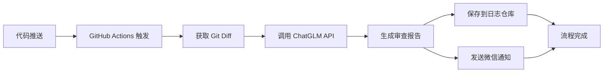

# OpenAI Code Review - AI驱动的自动化代码审查系统

<div align="center">


一个基于 GitHub Actions 和 ChatGLM 大语言模型的自动化代码审查系统，支持实时微信通知。

[功能特性](#功能特性) • [技术架构](#技术架构) • [快速开始](#快速开始) • [使用演示](#使用演示)

</div>

---

## 📋 目录

- [项目简介](#项目简介)
- [功能特性](#功能特性)
- [技术架构](#技术架构)
- [系统流程](#系统流程)
- [快速开始](#快速开始)
- [使用演示](#使用演示)
- [配置说明](#配置说明)
- [项目结构](#项目结构)
- [常见问题](#常见问题)

---

## 📖 项目简介

OpenAI Code Review 是一个智能化的代码审查系统，通过 GitHub Actions 实现 CI/CD 自动化流程。当代码提交到仓库时，系统会自动：

1. 📝 获取代码变更差异（git diff）
2. 🤖 调用 ChatGLM AI 模型进行智能代码审查
3. 💾 将审查结果保存到日志仓库
4. 📱 通过微信公众号推送审查结果通知

**适用场景：**
- 个人项目的代码质量把控
- 团队协作中的自动化代码审查
- 学习 CI/CD 和 AI 集成的实践项目

---

## ✨ 功能特性

### 🚀 核心功能

- **自动化触发**：代码推送到 `main` 分支自动触发审查流程
- **AI 智能审查**：基于 ChatGLM 大模型，提供专业的代码审查建议
- **结果持久化**：审查结果自动保存到 GitHub 日志仓库
- **实时通知**：通过微信模板消息实时推送审查结果

### 🏗️ 技术亮点

- **DDD 架构设计**：领域驱动设计，清晰的分层架构
- **模板方法模式**：灵活的代码审查流程封装
- **GitHub Actions 集成**：无需额外服务器，完全云端运行
- **安全配置管理**：使用 GitHub Secrets 管理敏感信息

---

## 🏛️ 技术架构

### 技术栈

| 技术 | 版本 | 说明 |
|------|------|------|
| Java | 11 | 核心开发语言 |
| Maven | 3.x | 项目构建工具 |
| GitHub Actions | - | CI/CD 自动化 |
| ChatGLM API | v4 | AI 代码审查 |
| 微信公众号 API | - | 消息推送 |

### 架构设计

```
openai-code-review-sdk/
├── domain/              # 领域层
│   ├── model/          # 领域模型
│   └── service/        # 领域服务（代码审查核心逻辑）
├── infrastructure/      # 基础设施层
│   ├── git/            # Git 操作
│   ├── openai/         # ChatGLM API 集成
│   └── weixin/         # 微信 API 集成
└── types/              # 通用工具类
```

**设计模式：**
- **模板方法模式**：`AbstractOpenAiCodeReviewService` 定义审查流程骨架
- **依赖注入**：通过构造函数注入各个基础设施组件
- **DDD 分层**：领域逻辑与技术实现分离

---

## 🔄 系统流程



**详细流程：**

1. **触发阶段**：开发者推送代码到 `main` 分支
2. **环境准备**：GitHub Actions 启动 Ubuntu 容器，配置 JDK 11
3. **下载 SDK**：从 GitHub Releases 下载代码审查 JAR 包
4. **获取变更**：使用 `git diff` 获取最近两次提交的代码差异
5. **AI 审查**：将代码差异发送给 ChatGLM 进行智能分析
6. **结果保存**：将审查结果以 Markdown 格式保存到日志仓库
7. **消息推送**：通过微信模板消息推送审查结果链接

---

## 🚀 快速开始

### 前置要求

- GitHub 账号
- 微信测试号（用于接收通知）
- ChatGLM API Key（智谱 AI）

### 部署步骤

#### 1️⃣ 创建日志仓库

在 GitHub 创建一个新仓库用于存储审查日志：

```
仓库名称：openai-code-review-log
可见性：Public 或 Private
初始化：勾选 "Add a README file"
```

#### 2️⃣ 编译并上传 JAR 包

```bash
# 克隆项目
git clone https://github.com/lqi14583-bot/openai-code-review.git
cd openai-code-review/openai-code-review-sdk

# 编译打包
mvn clean package

# 生成的 JAR 包位置
# target/openai-code-review-sdk-1.0.jar
```

将 JAR 包上传到 GitHub Releases：
- 进入项目 → Releases → Create a new release
- Tag: `v1.0`
- 上传 `openai-code-review-sdk-1.0.jar`

#### 3️⃣ 配置 GitHub Secrets

在项目设置中添加以下 Secrets（Settings → Secrets and variables → Actions）：

| Secret 名称 | 说明 | 获取方式 |
|------------|------|---------|
| `CODE_REVIEW_LOG_URI` | 日志仓库地址 | `https://github.com/你的用户名/openai-code-review-log` |
| `CODE_TOKEN` | GitHub Token | [生成 Token](https://github.com/settings/tokens) - 需要 `repo` 和 `workflow` 权限 |
| `WEIXIN_APPID` | 微信 AppID | [微信测试号](https://mp.weixin.qq.com/debug/cgi-bin/sandbox?t=sandbox/index) |
| `WEIXIN_SECRET` | 微信 Secret | 同上 |
| `WEIXIN_TOUSER` | 微信 OpenID | 扫码关注测试号后获取 |
| `WEIXIN_TEMPLATE_ID` | 模板消息 ID | 在测试号中创建模板消息 |
| `CHATGLM_APIHOST` | ChatGLM API 地址 | `https://open.bigmodel.cn/api/paas/v4/chat/completions` |
| `CHATGLM_APIKEYSECRET` | ChatGLM API Key | [智谱 AI](https://open.bigmodel.cn/usercenter/apikeys) |

**📸  ：GitHub Secrets 配置页面**
> 


#### 4️⃣ 配置微信模板消息

在微信测试号页面创建模板消息，内容如下：

```
{{first.DATA}}
项目名称：{{repo_name.DATA}}
分支名称：{{branch_name.DATA}}
提交者：{{commit_author.DATA}}
提交信息：{{commit_message.DATA}}
{{remark.DATA}}
```

**📸  ：微信模板消息配置**
> 


#### 5️⃣ 修改 Workflow 配置

确保 `.github/workflows/main-remote-jar.yml` 中的 JAR 下载地址指向你的仓库：

```yaml
- name: Download openai-code-review-sdk JAR
  run: wget -O ./libs/openai-code-review-sdk-1.0.jar https://github.com/你的用户名/openai-code-review/releases/download/v1.0/openai-code-review-sdk-1.0.jar
```

#### 6️⃣ 设置 GitHub Actions 权限

进入 Settings → Actions → General → Workflow permissions：
- 选择 **"Read and write permissions"**
- 勾选 **"Allow GitHub Actions to create and approve pull requests"**

**📸 ：GitHub Actions 权限设置**
> 


---

## 🎬 使用演示

### 触发代码审查

推送代码到 `main` 分支即可自动触发：

```bash
git add .
git commit -m "feat: add new feature"
git push origin main
```

### 查看运行结果

**📸 ：GitHub Actions 运行成功**
> 

**📸 ：微信通知消息**
> 

**📸  ：代码审查日志**
> 


### 审查结果示例

审查日志会保存在日志仓库中，格式如下：

```
openai-code-review-log/
└── 2024-01-15/
    └── openai-code-review-main-author-timestamp-xxxx.md
```

日志内容包含：
- 代码变更差异
- AI 审查建议
- 提交信息
- 时间戳

---

## ⚙️ 配置说明

### GitHub Actions Workflow

工作流配置文件：`.github/workflows/main-remote-jar.yml`

**触发条件：**
```yaml
on:
  push:
    branches:
      - main
  pull_request:
    branches:
      - main
```

**环境变量：**
所有敏感信息通过 GitHub Secrets 注入，确保安全性。

### 微信模板消息字段

| 字段 | 说明 |
|------|------|
| `first` | 消息标题 |
| `repo_name` | 仓库名称 |
| `branch_name` | 分支名称 |
| `commit_author` | 提交者 |
| `commit_message` | 提交信息 |
| `remark` | 审查结果链接 |

---

## 📁 项目结构

```
openai-code-review/
├── .github/
│   └── workflows/
│       └── main-remote-jar.yml          # GitHub Actions 工作流
├── openai-code-review-sdk/              # 核心 SDK
│   ├── src/main/java/
│   │   └── plus/gaga/middleware/sdk/
│   │       ├── OpenAiCodeReview.java    # 主入口
│   │       ├── domain/                  # 领域层
│   │       │   ├── model/               # 模型定义
│   │       │   └── service/             # 审查服务
│   │       ├── infrastructure/          # 基础设施层
│   │       │   ├── git/                 # Git 操作
│   │       │   ├── openai/              # ChatGLM 集成
│   │       │   └── weixin/              # 微信集成
│   │       └── types/                   # 工具类
│   └── pom.xml                          # Maven 配置
├── openai-code-review-test/             # 测试模块
├── docs/                                # 文档和图片
│   └── images/                          # 截图存放位置
└── README.md                            # 项目文档
```

---

## ❓ 常见问题

### Q1: 微信通知失败，显示 "invalid appid"

**原因：** `WEIXIN_APPID` 或 `WEIXIN_SECRET` 配置错误

**解决方案：**
1. 重新登录[微信测试号](https://mp.weixin.qq.com/debug/cgi-bin/sandbox?t=sandbox/index)
2. 精确复制 appID 和 appsecret（不要多复制空格）
3. 在 GitHub Secrets 中更新这两个值

### Q2: GitHub Actions 无法推送到日志仓库

**原因：** GitHub Token 权限不足或 Actions 权限未开启

**解决方案：**
1. 检查 `CODE_TOKEN` 是否有 `repo` 权限
2. 确认 Actions 权限设置为 "Read and write permissions"

### Q3: ChatGLM API 调用失败

**原因：** API Key 错误或额度不足

**解决方案：**
1. 检查 `CHATGLM_APIKEYSECRET` 格式是否正确（格式：`apiKey.apiSecret`）
2. 登录[智谱 AI](https://open.bigmodel.cn/)检查 API 额度

### Q4: 如何更换其他 AI 模型？

**方案：** 在 `infrastructure/openai` 目录下新增实现类

```java
public class ChatGPT implements IOpenAI {
    // 实现 IOpenAI 接口
}
```

然后在 `OpenAiCodeReview.java` 中切换实例化的类。

---

## 📊 技术细节

### 代码审查流程（模板方法模式）

```java
public abstract class AbstractOpenAiCodeReviewService {
    
    // 模板方法
    public String exec() {
        String diffCode = getDiffCode();           // 1. 获取代码差异
        String logUrl = codeReview(diffCode);      // 2. AI 审查
        pushMessage(logUrl);                       // 3. 推送通知
        return logUrl;
    }
    
    protected abstract String getDiffCode();
    protected abstract String codeReview(String diffCode);
    protected abstract void pushMessage(String logUrl);
}
```

### Git 操作封装

```java
public class GitCommand {
    public String diff() {
        // 获取最近两次提交的差异
        ProcessBuilder processBuilder = new ProcessBuilder("git", "diff", "HEAD~1", "HEAD");
        // ...
    }
}
```

### 微信 Token 管理

使用工具类自动获取和刷新 access_token：

```java
public class WXAccessTokenUtils {
    public static String getAccessToken(String appid, String secret) {
        // 调用微信 API 获取 token
    }
}
```

---

## 🤝 贡献

欢迎提交 Issue 和 Pull Request！

---

## 📄 许可证

本项目采用 MIT 许可证。详见 [LICENSE](LICENSE) 文件。

---

## 👨‍💻 作者

**lqi14583-bot**

- GitHub: [@lqi14583-bot](https://github.com/lqi14583-bot)
- 项目地址: [openai-code-review](https://github.com/lqi14583-bot/openai-code-review)

---

## 🙏 致谢

- [智谱 AI](https://open.bigmodel.cn/) - 提供 ChatGLM API
- [GitHub Actions](https://github.com/features/actions) - CI/CD 平台
- [微信公众平台](https://mp.weixin.qq.com/) - 消息推送服务

---

<div align="center">

**如果这个项目对你有帮助，请给个 ⭐ Star 支持一下！**

</div>
